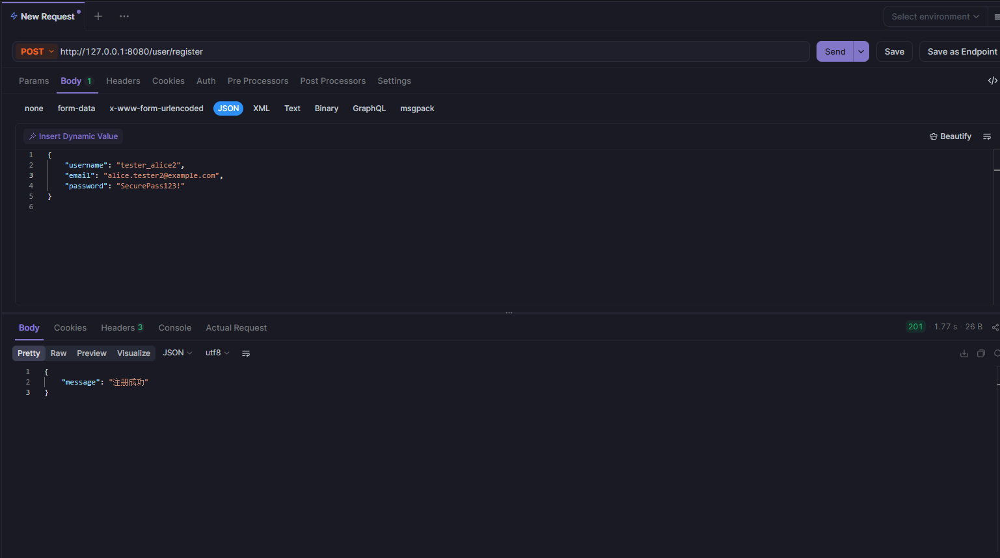
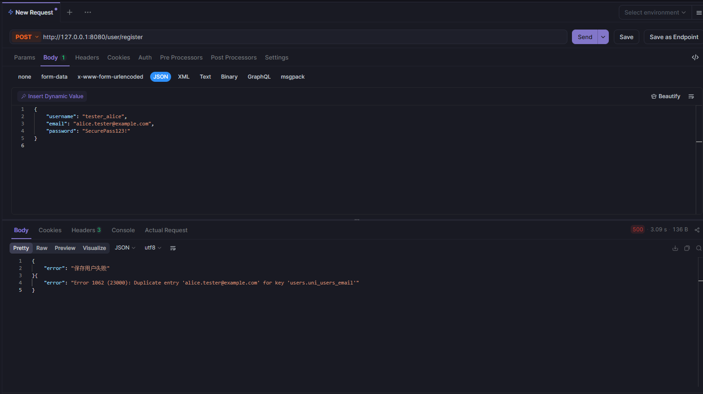
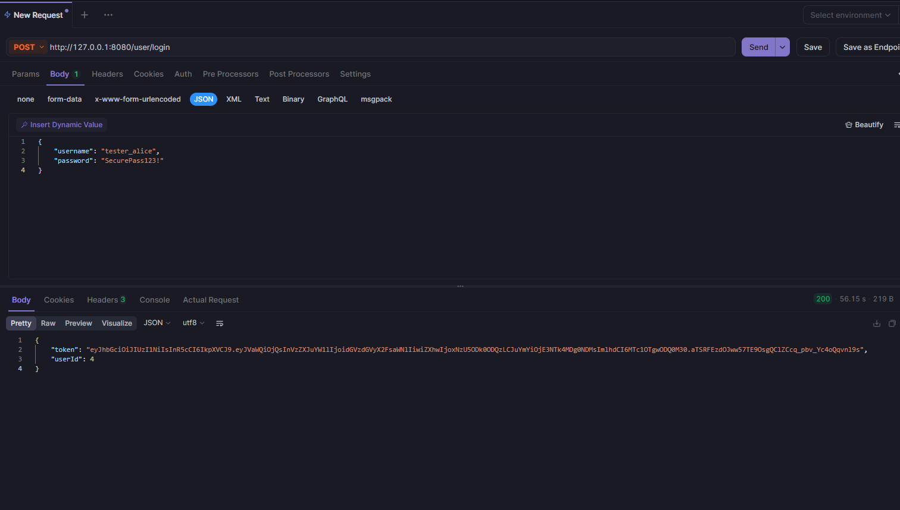
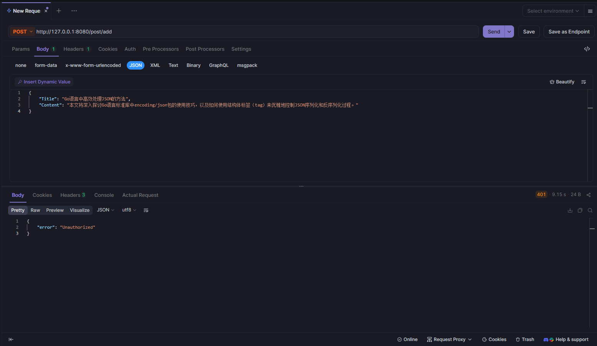
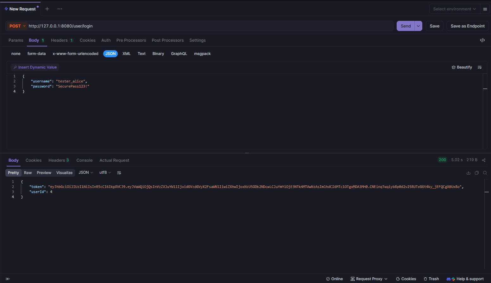
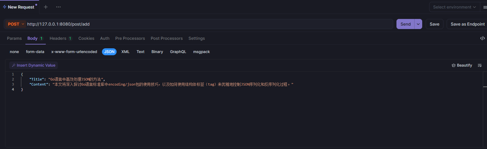
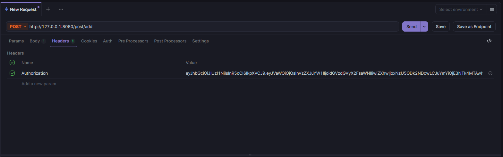
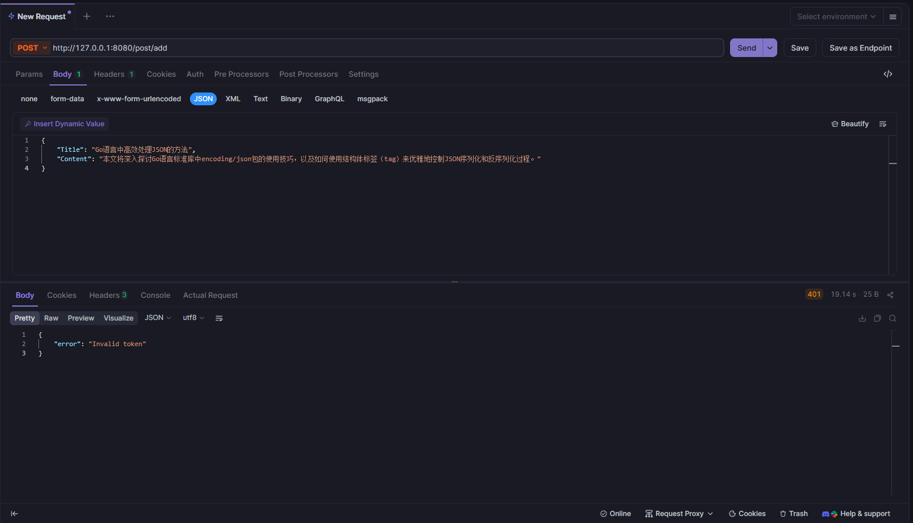
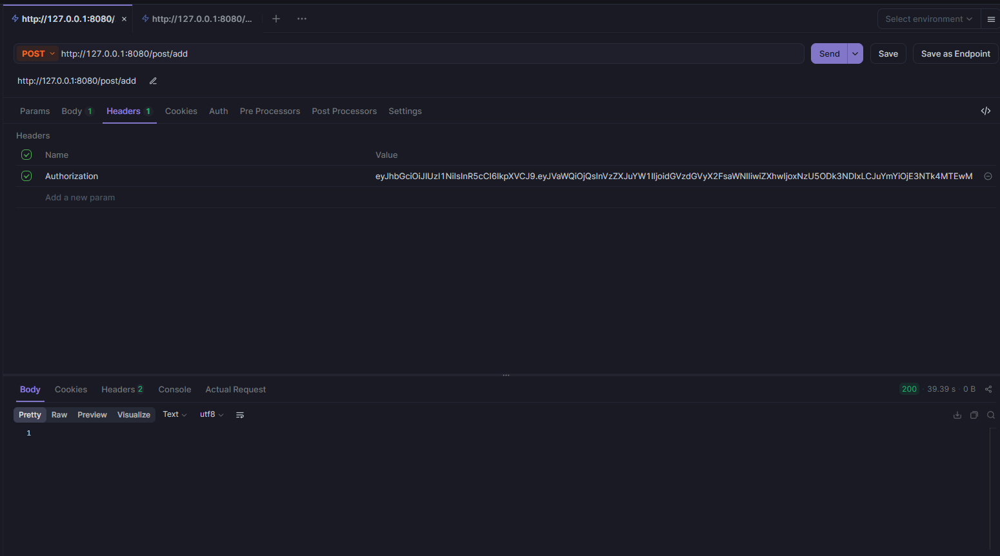
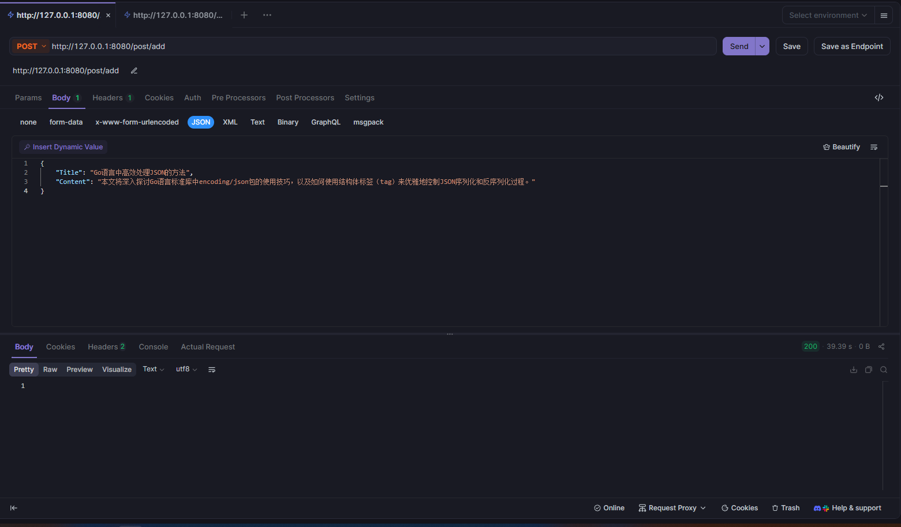

# API 测试文档

本文档提供了个人博客系统后端API的测试数据和接口说明。
数据登录 实现用户登录，文章登录以及回复登录与用户登录类似，所以并未实装，测试时仅仅测试用户登录验证中间件是否正常工作。

---

## 📝 用户注册接口

### 接口信息
- **URL**: `http://127.0.0.1:8080/user/register`
- **方法**: `POST`
- **Content-Type**: `application/json`

### 请求数据格式
```json
{
    "username": "tester_alice",
    "email": "alice.tester@example.com", 
    "password": "SecurePass123!"
}
```

### 字段说明
| 字段名 | 类型 | 必填 | 说明 |
|--------|------|------|------|
| username | string | 是 | 用户名，唯一标识 |
| email | string | 是 | 用户邮箱，唯一标识 |
| password | string | 是 | 用户密码，会进行加密存储 |

---

## 🔐 用户登录接口

### 接口信息
- **URL**: `http://127.0.0.1:8080/user/login`
- **方法**: `POST`
- **Content-Type**: `application/json`

### 请求数据格式
```json
{
    "username": "tester_alice",
    "password": "SecurePass123!"
}
```

### 字段说明
| 字段名 | 类型 | 必填 | 说明 |
|--------|------|------|------|
| username | string | 是 | 用户名 |
| password | string | 是 | 用户密码 |

---

## 📸 接口测试截图

### 用户注册接口测试


### 用户登录接口测试


### 接口响应示例


---
## 文章接口
### 接口信息
- **URL**: `http://127.0.0.1:8080/post/add`
- **方法**: `POST`
- **Content-Type**: `application/json`

### 请求数据格式
```json
{
    "Title": "Go语言中高效处理JSON的方法",
    "Content": "本文将深入探讨Go语言标准库中encoding/json包的使用技巧，以及如何使用结构体标签（tag）来优雅地控制JSON序列化和反序列化过程。"
}
```


### 字段说明
| 字段名 | 类型 | 必填 | 说明 |
|--------|------|------|------|
| Title | string | 是 | 文章标题 |
| Content | string | 是 | 文章内容 |


## 📸 接口测试截图
没有登录的情况


登录之后 超时





登录之后 成功



---

## 💡 使用说明

1. **测试顺序**：建议先调用注册接口创建用户，再使用登录接口获取token
2. **密码要求**：密码需要包含大小写字母、数字和特殊字符
3. **响应格式**：成功响应包含状态码和相应数据，错误响应包含错误信息
4. **JWT Token**：登录成功后返回的token需要在后续请求的Header中携带

### Header格式
```
Authorization: Bearer <your_jwt_token>
```

---

> **注意**：请确保服务器运行在 `127.0.0.1:8080` 地址，或根据实际部署环境修改URL。
